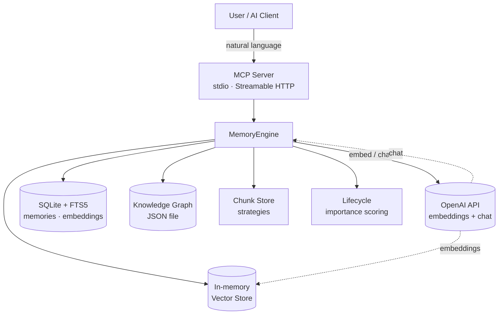
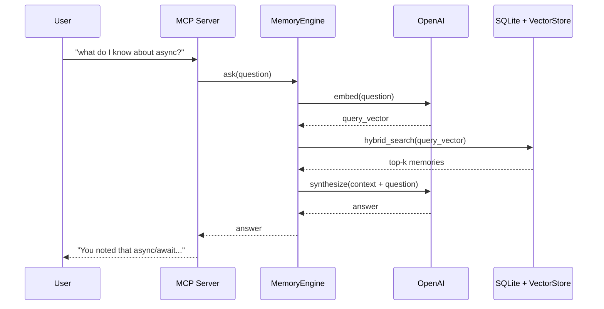
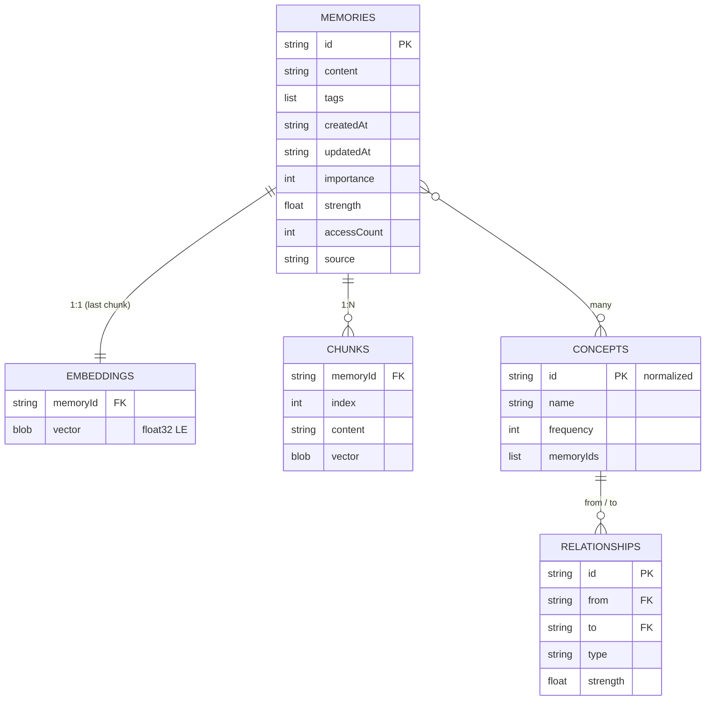

# 🧠 AdaptiveMemoryEngine

**A RAG (Retrieval-Augmented Generation) memory layer for AI assistants.**

[](https://www.python.org/)
[](LICENSE)
[](https://modelcontextprotocol.io/)
[](https://platform.openai.com/)

AdaptiveMemoryEngine gives any MCP-compatible AI assistant (Claude Desktop, Cline, etc.) a **persistent, searchable long-term memory** powered by semantic embeddings, hybrid retrieval, and an automatically built knowledge graph.

Ask your assistant *"what do I know about Python async?"* — and it remembers across sessions.

---

## ✨ What it does

- **Stores** text you save as semantic vectors using OpenAI `text-embedding-3-small`
- **Retrieves** the most relevant memories for any query using hybrid (semantic + keyword) search
- **Answers** questions using a RAG pipeline — retrieved context fed to `gpt-4o-mini`
- **Links** concepts together in a knowledge graph that grows as you save memories
- **Speaks MCP** — works with Claude Desktop, Cline, and any MCP-compatible client

---

## 🏗 Architecture



### Data flow (RAG pipeline)



---

## 🚀 Quick Start

### 1. Install

```bash
git clone https://github.com/rakesh1308/AdaptiveMemoryEngine.git
cd AdaptiveMemoryEngine
pip install -e .
```

### 2. Configure

```bash
cp .env.example .env
# edit .env and set OPENAI_API_KEY=sk-...
```

### 3. Run as an MCP server

```bash
adaptive-memory-server
```

Or via the module:

```bash
python -m adaptive_memory_engine.server
```

By default it speaks **stdio**. To expose HTTP (for remote clients), set `TRANSPORT=http` and `PORT=3000`.

### 4. Connect from Claude Desktop

Add to `claude_desktop_config.json`:

```json
{
  "mcpServers": {
    "memory": {
      "command": "python",
      "args": ["-m", "adaptive_memory_engine.server"],
      "env": {
        "OPENAI_API_KEY": "sk-your-key-here"
      }
    }
  }
}
```

Restart Claude Desktop, then ask:

- *"Remember that I prefer TypeScript for new projects"*
- *"What do I know about distributed systems?"*
- *"Summarize my notes on machine learning"*

---

## 🛠 MCP Tools

| Tool | Purpose |
|------|---------|
| `store_memory` | Save content with automatic embeddings and optional AI auto-tagging |
| `get_memory` | Retrieve a memory by key |
| `update_memory` | Update memory content and/or tags (`merge_tags=true` to union) |
| `delete_memory` | Delete a memory by key |
| `search` | Hybrid semantic + keyword search |
| `list_memories` | List memories, optionally filtered by text or tag |
| `ask` | RAG-style Q&A over your memories |
| `summarize` | Summarize memories on a topic (or by key list) |
| `query_graph` | Query the knowledge graph (related concepts / path-finding) |
| `get_stats` | Engine + provider statistics |
| `backup` | Create a JSON snapshot |
| `get_provider_info` | Show current AI provider configuration |

---

## 🧠 How memory works

### Storage layers



Every memory also gets an `importance` score (0–100) on creation, weighted across access frequency, recency, graph centrality, content quality, and reference count.

---

## ⚙️ Environment Variables

| Variable | Required | Default | Description |
|----------|----------|---------|-------------|
| `OPENAI_API_KEY` | ✅ | — | OpenAI API key |
| `OPENAI_BASE_URL` | ❌ | `https://api.openai.com/v1` | Override for Azure / proxies |
| `OPENAI_EMBEDDING_MODEL` | ❌ | `text-embedding-3-small` | |
| `OPENAI_CHAT_MODEL` | ❌ | `gpt-4o-mini` | |
| `DATA_DIR` | ❌ | `./data` (local) / `/data` (container) | Where SQLite + graph JSON live |
| `TRANSPORT` | ❌ | auto (`http` when `PORT` set) | `stdio` or `http` |
| `PORT` | ❌ | `3000` | Set to enable HTTP transport |

---

## 📁 Project structure

```
AdaptiveMemoryEngine/
├── src/adaptive_memory_engine/
│   ├── server.py                # MCP server (stdio + HTTP)
│   ├── engine.py                # MemoryEngine orchestrator
│   ├── config.py                # env / .env loader
│   ├── events.py                # EventBus
│   ├── chunking.py              # Chunk strategies + store
│   ├── knowledge_graph.py       # Concept + relationship graph
│   ├── lifecycle.py             # Importance scoring + access tracking
│   └── providers/               # OpenAI provider
├── data/                        # SQLite + graph (gitignored)
├── tests/pre_deploy.py          # End-to-end regression test
├── pyproject.toml
└── README.md
```

---

## 🐳 Docker

```bash
docker build -t ame .
docker run -p 3000:3000 \
  -e OPENAI_API_KEY=sk-... \
  -v $(pwd)/data:/data \
  ame
```

Endpoints:

- `POST /mcp` — MCP JSON-RPC
- `GET /health` — `{status, memories, concepts, embeddings, provider}`
- `GET /` — server info + stats

The image is platform-agnostic — runs the same on any Docker host (local, AWS, GCP, Fly.io, Render, Railway, etc.) as long as you mount a volume at `/data` for persistence.

---

## 🧪 Testing

```bash
python tests/pre_deploy.py
```

Runs the full end-to-end suite: schema, FTS5, embedding load, knowledge graph, engine CRUD, hybrid search, MCP HTTP round-trip, stdio MCP, and chunking strategies.

---

## � For developers

### Data contracts

- **`data/memories.db`** — SQLite schema: tables `memories`, `embeddings`, `access_log`, virtual table `memories_fts` (FTS5, external-content).
  PRAGMAs: `journal_mode=DELETE`, `synchronous=NORMAL`, `locking_mode=NORMAL`.
  Embedding BLOBs are little-endian float32.
- **`data/knowledge-graph.json`** — `{concepts: [[id, node], ...], relationships: [...], conceptIndex: [[id, [memoryId, ...]], ...], savedAt}`.
  Concept ids are normalised: `lowercase → non-alphanum → '_' → trim '_'`.

### Conventions

- Logging goes to **stderr** (stdio MCP keeps stdout clean).
- All datetimes use `now_iso()` from `events.py`.
- Embedding vectors are persisted as little-endian float32 (`struct.pack(f"<{n}f", ...)`).
- New MCP tools go in `server.py:_register_tools`.
- The single shipped provider is OpenAI (`src/adaptive_memory_engine/providers/openai_provider.py`).

### Adding a new provider

1. Subclass `EmbeddingProvider` (for embeddings) or `IntelligentProvider` (for chat + helpers) in `src/adaptive_memory_engine/providers/`.
2. Wire it into `providers/factory.py`.
3. Add credentials / config fields to `config.py`.
4. Document the new env vars in the table above.

---

## �📄 License

MIT © Rakesh Sonawane

---

## 🔗 Links

- [Model Context Protocol](https://modelcontextprotocol.io/)
- [MCP Python SDK](https://github.com/modelcontextprotocol/python-sdk)
- [OpenAI Embeddings](https://platform.openai.com/docs/guides/embeddings)
